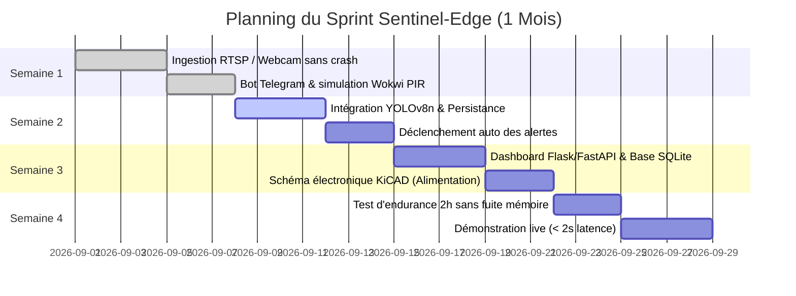

# 📄 CAHIER DES CHARGES : SENTINEL-EDGE (MVP 1 MOIS — 0 F CFA)

---

## 1. Objectifs & Définition du Projet

- **Nom de code :** Sentinel-Edge (SafeHome Africa)
- **Mission :** Développer un système d'alerte et de vision intelligente locale (**Edge AI**) capable de détecter les intrusions humaines en temps réel et d'émettre des notifications instantanées chiffrées, sans dépendre d'une connexion internet permanente ni de serveurs cloud externes tiers.
- **Contrainte budgétaire du MVP :** **0 F CFA** (exploitation stricte et exclusive des équipements existants : ordinateurs portables personnels, smartphones Android de récupération et simulateurs logiciels embarqués).
- **Durée du sprint MVP :** 1 mois (4 semaines calendaires).

---

## 2. Spécifications Fonctionnelles

### 2.1 Acquisition Vidéo
- Capture vidéo continue d'un flux local généré par :
  - Un smartphone Android (via flux RTSP / HTTP généré par IP Webcam sur le réseau Wi-Fi local).
  - Une webcam intégrée ou USB connectée à un ordinateur portable (Linux Ubuntu).
- Résolution cible : 720p (1280x720) à une cadence de 15 à 25 FPS pour concilier fluidité et consommation CPU modérée.

### 2.2 Détection & Filtrage Intelligent
- **Détection stricte :** Identification ciblée des personnes humaines (classe COCO 0 : `person`).
- **Filtrage des bruits optiques :** Rejet systématique des perturbations environnementales (ombres mouvantes, variations brutales de luminosité, animaux domestiques, feuillages).
- **Seuil de confiance paramétrable :** Seuil minimal configurable (défaut : `0.60`).
- **Décision temporelle anti-faux positifs :** Confirmation d'intrusion conditionnée par la détection continue d'une personne sur au moins **2 frames successives**. Toute absence réinitialise instantanément le compteur.

### 2.3 Notification d'Intrusion
- Émission asynchrone non-bloquante d'une alerte dès la confirmation de l'intrusion.
- Canal de transmission : Bot Telegram dédié via l'API Telegram Bot (`sendPhoto`).
- Contenu du message d'alerte :
  - Cliché horodaté de l'intrusion (snapshot annoté).
  - Boîte englobante rouge (bounding box) entourant le suspect avec label et score de confiance.
  - Horodatage précis à la seconde près.
- **Temporisation anti-spam (Cooldown) :** Période réfractaire de 5 à 10 secondes minimum entre deux alertes consécutives pour préserver la bande passante et éviter le déni de service.

### 2.4 Historisation & Consultation Locale
- Journalisation persistante de chaque événement dans une base de données locale relationnelle légère (**SQLite3**).
- Conservation des métadonnées : identifiant, date/heure, score de confiance, chemin du cliché sauvegardé.
- Consultation locale via un tableau de bord minimal (Flask / FastAPI) visualisant l'historique et le flux direct.

---

## 3. Spécifications Techniques & Matrice d'Évolution

| Domaine | Composant MVP (Logiciel / Simulé - 0 F CFA) | Rôle dans le Sprint MVP | Évolution V1 (Cible Matérielle Déployable) |
| :--- | :--- | :--- | :--- |
| **Optique** | Smartphone Android (IP Webcam) / Webcam PC | Ingestion de flux RTSP/HTTP 720p (15-25 FPS) | Raspberry Pi Camera Module 2 ou 3 |
| **Traitement** | PC Portable (Ubuntu Linux, x86_64) | Inférence IA locale, orchestrateur, base SQLite | Raspberry Pi 4 Model B (2 Go ou 4 Go RAM) |
| **Modèle IA** | Ultralytics YOLOv8n (PyTorch / Python) | Détection d'humains optimisée CPU | YOLOv8n quantifié INT8 / NCNN / TFLite |
| **Notification** | Telegram Bot API (`requests` asynchrone) | Transmission chiffrée d'alertes instantanées | Bot Telegram + Fallback Alarme Sonore / Buzzer |
| **Base & Web** | SQLite3 + Python standard | Persistance locale des logs d'intrusion | Base SQLite durcie + Dashboard FastAPI local |
| **Hardware** | Simulateur Wokwi / KiCAD 7+ | Conception schématique, validation code C++ | PCB imprimé personnalisé, Relais 5V, Accu Li-Ion |

---

## 4. Cadre Opérationnel & Validation par Phase

### Détail des jalons hebdomadaires :
- **Semaine 1 (Acquisition & Alertes de base) :**
  - Flux vidéo du smartphone ingéré sans plantage via OpenCV multithreadé.
  - Bot Telegram configuré et capable d'émettre des messages tests avec pièce jointe.
  - Environnement Wokwi opérationnel (ESP32 + capteur PIR virtuel).
- **Semaine 2 (Liaison IA & Notifications) :**
  - Modèle YOLOv8n connecté au flux direct avec filtrage de classe 0.
  - Déclenchement automatique de l'envoi de capture sur Telegram lors du passage d'une personne.
  - Câblage virtuel et code C/C++ validés sous simulateur.
- **Semaine 3 (Dashboard, Logs & Schématique Matérielle) :**
  - Dashboard web minimal affichant l'historique des captures stockées dans SQLite.
  - Schéma électrique du circuit d'alimentation de secours (PowerBank / batterie Li-Ion) achevé sous KiCAD.
- **Semaine 4 (Tests Système & Démonstration Globale) :**
  - Test d'endurance de 2 heures d'affilée sans fuite mémoire ni blocage réseau.
  - Démonstration live : intrusion simulée dans la pièce, réception de l'alerte sur smartphone en moins de 2 secondes.

---

## 5. Conditions de Sortie & Passage à la V1 Matérielle

Le projet n'autorisera le décaissement financier pour l'achat des composants physiques (Raspberry Pi, caméra, batterie, relais) que si les **trois critères d'acceptation stricts** suivants sont formellement validés :

1. **Stabilité du pipeline IA :** Le pipeline logiciel détecte correctement un humain sans bloquer l'ingestion vidéo ni accumuler de retard (drop des frames anciennes en mémoire tampon).
2. **Reproductibilité des alertes :** Les alertes Telegram parviennent au destinataire avec un taux de délivrabilité de 100% et un délai inférieur à 2 secondes sur réseau Wi-Fi local.
3. **Nomenclature matérielle chiffrée :** La liste des composants réels avec leurs prix exacts vérifiés sur les marchés locaux de Bamako est finalisée par le pôle électronique.
