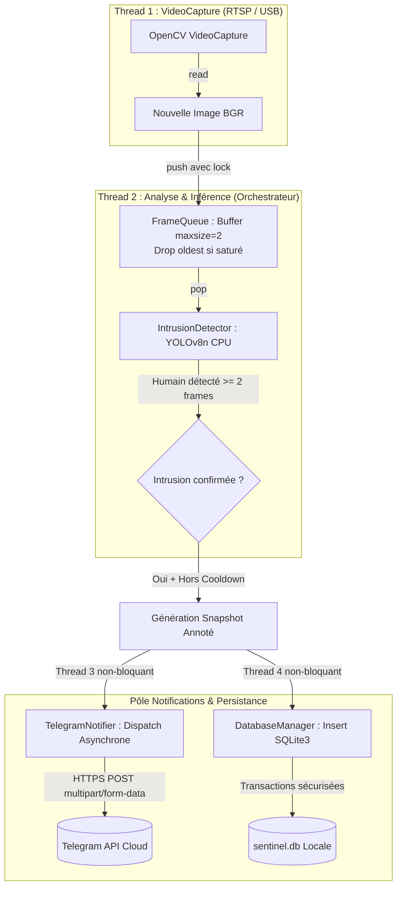

# 🛠️ DOSSIER TECHNIQUE DE GÉNIE LOGICIEL : SENTINEL-EDGE (MVP V0)

Ce dossier technique couvre l'ensemble des livrables de génie logiciel, de modélisation système et d'outillage organisationnel nécessaires pour exécuter le projet **Sentinel-Edge** sans dépendance matérielle initiale.

---

## 1. Architecture Logicielle & Découplage Multithreadé

### 1.1 Problématique de Latence & Solution Architecturales
Dans les architectures de vision par ordinateur naïves, la boucle principale effectue séquentiellement :
`Capture d'image (I/O)` $\rightarrow$ `Inférence IA (CPU)` $\rightarrow$ `Écriture disque (I/O)` $\rightarrow$ `Envoi Réseau HTTP (I/O)`.

Ce séquencement est inadapté à un déploiement temps réel : un ralentissement de réseau (appel Telegram bloquant) ou un pic de calcul YOLO entraîne la saturation du buffer OpenCV et un décalage cumulatif (drift) de plusieurs secondes sur le flux direct.

Pour garantir qu'aucun blocage réseau ou calcul d'inférence n'interrompe l'ingestion vidéo, **Sentinel-Edge** adopte une **architecture événementielle découplée à 4 threads concurrents** avec file d'attente à élimination d'anciennes images (*drop oldest*) :



### 1.2 Rôle des 4 Threads
1. **Thread 1 (`VideoStream`) :** Dédié exclusivement à la lecture du capteur ou du flux RTSP. Il maintient en permanence la dernière frame disponible sous un verrou (`threading.Lock`), absorbant les variations de débit de la caméra.
2. **Thread 2 (`Main / App`) :** Consomme la dernière image, exécute l'inférence YOLOv8n filtrée sur la classe 0 (`person`), applique l'automate temporel et pilote les décisions.
3. **Thread 3 (`TelegramNotifier`) :** Déclenche un thread worker *daemon* à chaque alerte pour téléverser le cliché sur l'API Telegram sans bloquer la boucle de détection.
4. **Thread 4 (`DatabaseManager`) :** Sérialise et persiste les horodatages, niveaux de confiance et chemins de fichiers dans SQLite.

---

## 2. Organisation Git & Stratégie de Collaboration

### 2.1 Arborescence Standardisée du Dépôt
```text
sentinel-edge/
├── .gitignore              # Règles d'exclusion strictes (venv, caches, modèles .pt, SQLite)
├── README.md               # Documentation d'accueil et vitrine GitHub
├── CAHIER_DES_CHARGES.md   # Spécifications fonctionnelles et jalons du sprint
├── DOSSIER_TECHNIQUE.md    # Présente architecture logicielle et nomenclature
├── EXPLICATION_CODE.md     # Analyse détaillée ligne par ligne du code source
├── config.py               # Centralisation des paramètres d'environnement
├── requirements.txt        # Dépendances Python déclarées
├── core/
│   ├── __init__.py         # Package core avec export des classes publiques
│   ├── detector.py         # Classe IntrusionDetector (YOLOv8 + persistance)
│   ├── stream.py           # Classe VideoStream (Capture vidéo multithreadée)
│   ├── notifier.py         # Classe TelegramNotifier (Alertes asynchrones)
│   └── database.py         # Classe DatabaseManager (Gestionnaire SQLite)
├── app.py                  # Orchestrateur principal de production
└── simu_hardware/          # Espace de conception électronique
    ├── wokwi/              # Code C++ et simulation ESP32 + capteur PIR
    └── pcb_kicad/          # Schémas électroniques d'alimentation KiCAD
```

### 2.2 Règles de Gestion de Branches & Qualité
- **Branche `main` protégée :** Aucun push direct autorisé. Tout changement transite par une Pull Request (`feat/*`, `fix/*`).
- **Commits conventionnels :** Respect du standard [Conventional Commits](https://www.conventionalcommits.org/) (`feat:`, `fix:`, `docs:`, `refactor:`, `test:`).
- **Zéro fuite d'artefacts lourds :** Les fichiers binaires volumineux (poids `.pt`, `.onnx`, bases `.sqlite3`, vidéos de capture) sont formellement exclus du suivi Git par `.gitignore`.

---

## 3. Workflow Trello & Découpage Agile (Sprint 4 Semaines)

Les tâches de développement sont structurées en 5 colonnes sur le tableau Trello du projet :
`Backlog Général` $\rightarrow$ `Sprint 1` $\rightarrow$ `Sprint 2` $\rightarrow$ `En Cours / En Revue` $\rightarrow$ `Terminé`.

### Répartition des Tickets Prioritaires :

#### Sprint 1 (Semaines 1–2) : Socle Logiciel & Alertes
- `[IA]` Implémenter la classe `VideoStream` multithreadée avec reconnexion automatique.
- `[IA]` Intégrer l'inférence YOLOv8n avec filtrage de classe (`person`) et persistance temporelle.
- `[RÉSEAU]` Créer le bot Telegram via BotFather et implémenter `TelegramNotifier`.
- `[RÉSEAU]` Configurer la base de données SQLite3 et la table de journalisation d'intrusions.
- `[ÉLEC]` Modéliser sur Wokwi le circuit ESP32 + capteur PIR virtuel + buzzer d'avertissement.
- `[DOC]` Rédiger le guide d'installation locale et les tests d'intégration.

#### Sprint 2 (Semaines 3–4) : Dashboard, Électronique & Démonstration
- `[RÉSEAU]` Développer l'interface web Flask / FastAPI minimale pour consulter l'historique des captures.
- `[ÉLEC]` Concevoir le schéma d'alimentation avec circuit de basculement batterie sur KiCAD.
- `[ÉLEC]` Modéliser le boîtier protecteur 3D sous FreeCAD / Fusion 360.
- `[GLOBAL]` Exécuter le test d'endurance de 2 heures d'affilée sans fuite mémoire.
- `[GLOBAL]` Organiser la démonstration live en conditions réelles (délai d'alerte < 2 secondes).

---

## 4. Nomenclature & Projection Budgétaire (Pour le Pôle Électronique)

En vue de la transition vers la version matérielle autonome (**V1 Déployable**), voici la grille d'estimation budgétaire établie sur la base des prix constatés sur les marchés locaux de **Bamako** :

| Composant Matériel | Référence Recommandée | Rôle Technique | Fourchette de Prix Estimée (FCFA) |
| :--- | :--- | :--- | :--- |
| **Micro-ordinateur** | Raspberry Pi 4 (2 Go ou 4 Go) | Calcul local Edge AI et orchestration | 35 000 – 45 000 F CFA |
| **Capteur Optique** | Pi Camera Module 2 ou 3 | Capture grand angle 1080p native | 10 000 – 14 000 F CFA |
| **Capteur Présence** | Capteur PIR HC-SR501 | Réveil physique basse consommation | 1 000 – 1 500 F CFA |
| **Actionneurs** | Relais 5V 1 voie + Buzzer piézo | Déclenchement projecteur / alarme sonore | 1 500 – 2 500 F CFA |
| **Alimentation UPS** | Module PowerBank Li-Ion 5V/3A | Continuité 2h à 4h en cas de délestage | 6 000 – 9 000 F CFA |
| **Connectique & Câbles** | Câbles Dupont + Alimentation secteur | Câblage GPIO et alimentation sécurisée | 2 000 – 3 000 F CFA |
| **TOTAL ESTIMÉ V1** | — | **Système matériel autonome complet** | **55 500 – 75 000 F CFA** |

---

## 5. Spécifications des Interfaces Logicielles

### 5.1 Interface `IntrusionDetector` (`core/detector.py`)
```python
detector = IntrusionDetector(
    model_name="yolov8n.pt",
    conf_thresh=0.60,
    persistence=2,
    device="cpu"
)
is_confirmed, highest_conf, annotated_frame = detector.process_frame(frame)
```

### 5.2 Interface `VideoStream` (`core/stream.py`)
```python
stream = VideoStream(src=0)  # ou URL RTSP
ret, frame = stream.read()
stream.release()
```

### 5.3 Interface `TelegramNotifier` (`core/notifier.py`)
```python
notifier = TelegramNotifier(token="BOT_TOKEN", chat_id="CHAT_ID")
notifier.send_alert_async(image_path="captures/alert.jpg", message="⚠️ Alerte Intrusion !")
```

### 5.4 Interface `DatabaseManager` (`core/database.py`)
```python
db = DatabaseManager(db_path="sentinel.db")
db.log_intrusion(confidence=0.87, image_path="captures/alert.jpg")
```
