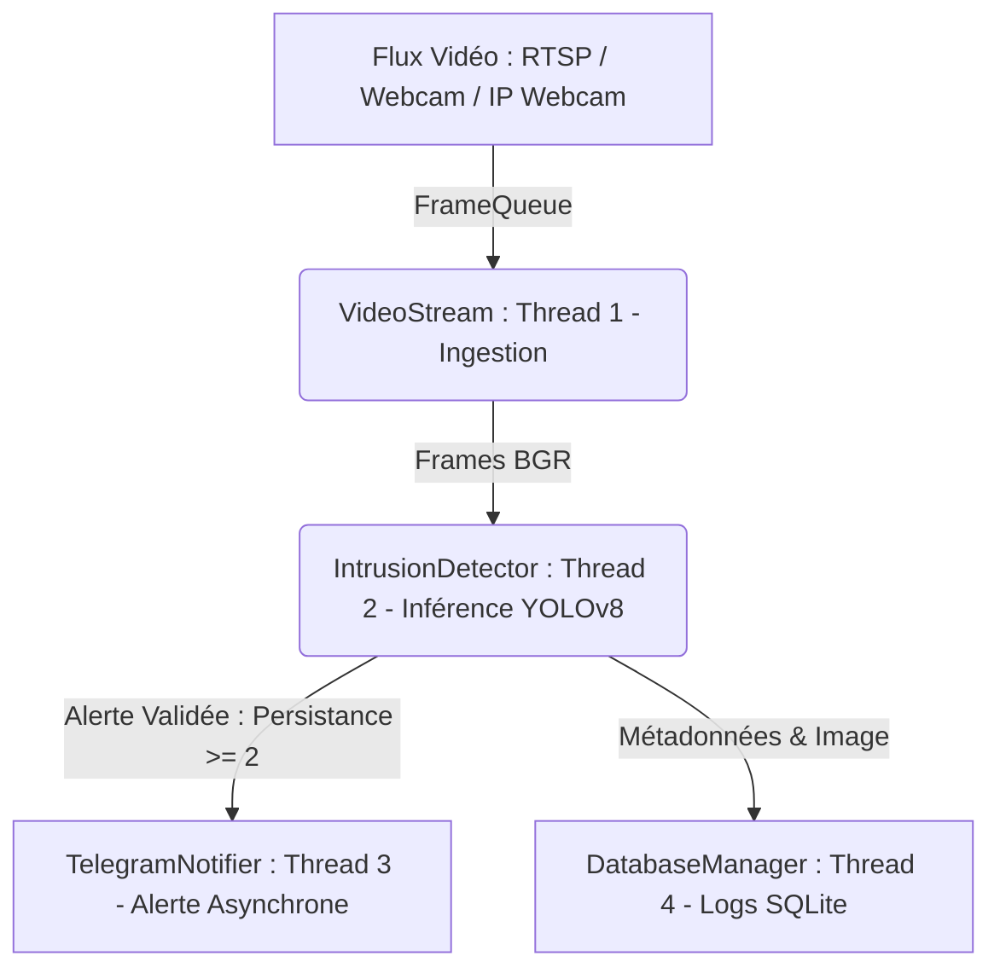
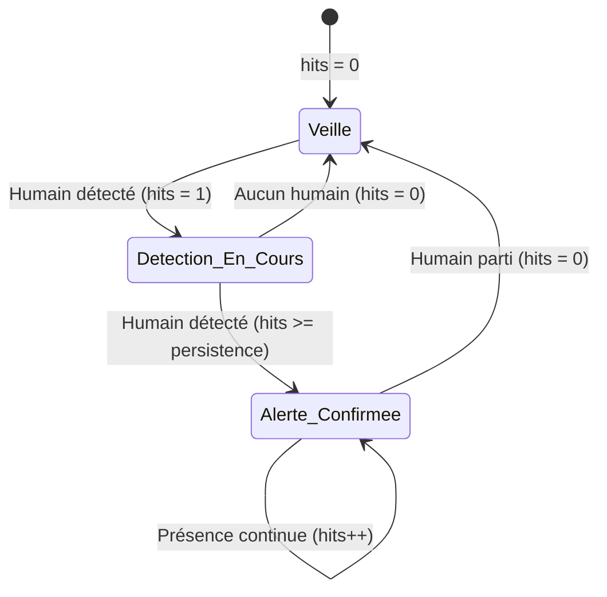

# 📘 Documentation Technique et Explication du Code : Sentinel-Edge (MVP V0)

Ce document détaille l'architecture logicielle, les choix de conception MLOps, ainsi que l'explication ligne par ligne des composants implémentés pour le projet **Sentinel-Edge**.

---

## 1. Vue d'Ensemble de l'Architecture Système

Le système **Sentinel-Edge** a pour vocation de fournir un pipeline de vidéosurveillance intelligente locale (Edge AI) à coût zéro matériel en exploitant un processeur standard (CPU Linux).

Pour éviter tout blocage d'acquisition vidéo lors des inférences ou des appels réseau, le projet adopte une architecture modulaire et découplée :



---

## 2. Analyse Approfondie des Composants

### 2.1 Configuration Globale : [`config.py`](config.py)

Le fichier centralise l'ensemble des constantes et hyperparamètres du système, permettant une modification dynamique via variables d'environnement sans altérer le code source :

```python
class Config:
    VIDEO_SOURCE = os.getenv("VIDEO_SOURCE", "0")
    CONFIDENCE_THRESHOLD = float(os.getenv("CONFIDENCE_THRESHOLD", "0.60"))
    TARGET_CLASS = 0  # Classe COCO 0 = 'person'
    PERSISTENCE_FRAMES = 2
    ALERT_COOLDOWN = int(os.getenv("ALERT_COOLDOWN", "10"))
    ...
```

- **`CONFIDENCE_THRESHOLD` (défaut : 0.60)** : Seuil en dessous duquel toute détection candidate est immédiatement écartée.
- **`PERSISTENCE_FRAMES` (défaut : 2)** : Nombre consécutif de détections positives requis pour valider formellement une alerte.
- **`ALERT_COOLDOWN` (défaut : 10s)** : Intervalle minimal entre deux alertes envoyées sur Telegram pour éviter le spam.

---

### 2.2 Détecteur d'Intrusion : [`core/detector.py`](core/detector.py)

La classe `IntrusionDetector` constitue le cœur algorithmique du traitement d'images.

#### A. Initialisation (`__init__`)
```python
def __init__(
    self,
    model_name: Union[str, Path] = "yolov8n.pt",
    conf_thresh: float = 0.60,
    persistence: int = 2,
    device: str = "cpu",
) -> None:
```
- **Validation stricte** : Vérifie que le seuil de confiance est borné dans $[0.0, 1.0]$ et que la persistance est au moins de 1.
- **Isolation d'état** : L'attribut `self.consecutive_hits = 0` conserve l'historique temporel propre à l'instance, évitant toute variable globale.
- **Modèle compact** : Chargement de `yolov8n.pt` (Nano), modèle le plus léger de la famille YOLOv8 (~3.2 millions de paramètres), idéal pour un débit suffisant sur CPU.

---

#### B. Optimisation de l'Inférence CPU
```python
results = self.model(
    source=frame,
    classes=[self.TARGET_CLASS_ID],  # COCO 0 = 'person'
    conf=self.conf_thresh,           # Seuil 0.60
    device=self.device,              # 'cpu'
    verbose=False,                   # Supprime la latence d'affichage console
)
```
- **Filtrage amont via `classes=[0]`** : Au lieu de calculer les boîtes pour les 80 classes du jeu de données COCO puis de filtrer en Python, Ultralytics ignore les 79 autres classes lors du Non-Maximum Suppression (NMS). Cela réduit la consommation de mémoire et le temps de calcul CPU.
- **`verbose=False`** : Évite les écritures bloquantes répétées sur la sortie standard (stdout), qui dégradent le framerate en boucle temps réel.

---

#### C. Algorithme de Persistance Temporelle (Anti-Faux Positifs)

Dans un environnement extérieur ou semi-ouvert, des bruits visuels transitoires (ombres mouvantes, reflets solaires, insectes ou branches devant la caméra) peuvent générer une fausse détection sur une seule image isolée ($N=1$).

L'automate à état fini suivant élimine ces perturbations :



**Logique d'implémentation :**
```python
if detected:
    self.consecutive_hits += 1
else:
    self.consecutive_hits = 0

is_confirmed: bool = self.consecutive_hits >= self.persistence
```
- Si une personne apparaît sur une frame : `consecutive_hits` passe à 1 $\rightarrow$ `is_confirmed = False` (pas de fausse alerte).
- Si la personne est toujours là à la frame suivante : `consecutive_hits` passe à 2 $\rightarrow$ `is_confirmed = True` (alerte confirmée).
- Si la détection disparaît ne serait-ce qu'une seule frame : `consecutive_hits` est réinitialisé à 0.

---

#### D. Sortie & Bounding Boxes
La méthode `process_frame(frame)` retourne :
```python
return is_confirmed, highest_conf, annotated_frame
```
- `is_confirmed (bool)` : Indique si l'intrusion remplit la condition de persistance.
- `highest_conf (float)` : Le score le plus élevé parmi toutes les personnes détectées sur l'image.
- `annotated_frame (np.ndarray)` : Copie annotée de la frame avec :
  - Boîte englobante rouge `(0, 0, 255)` tracée via `cv2.rectangle`.
  - Cartouche de fond plein pour garantir la lisibilité du texte même sur fond sombre ou complexe.
  - Label `"Humain: <score>"` arrondi à 2 décimales.

---

#### E. Banc de Test Autonome (`if __name__ == "__main__":`)
Permet de tester le composant directement sur webcam (`python3 core/detector.py 0`).

- **Calcul de FPS lissé** :
  Pour éviter les variations brusques d'affichage du FPS dues aux micro-latences d'OpenCV, un filtre à réponse impulsionnelle infinie (IIR / moyenne mobile exponentielle) est appliqué :
  $$\text{FPS}_{\text{lissé}} = \alpha \cdot \text{FPS}_{\text{instantané}} + (1 - \alpha) \cdot \text{FPS}_{\text{précédent}} \quad (\alpha = 0.1)$$
- **Affichage HUD (Head-Up Display)** :
  - **VERT** : `STATUT : [VEILLE - AUCUNE INTRUSION]`
  - **ORANGE** : `STATUT : [DETECTION EN COURS - 1/2]`
  - **ROUGE** : `STATUT : [ALERTE INTRUSION CONFIRMEE]`
- **Commandes interactives** :
  - Touche `q` ou `Echap` : Quitter proprement avec libération de la ressource caméra.
  - Touche `r` : Réinitialiser manuellement le compteur de persistance.

---

## 3. Guide d'Exécution

### Installation de l'environnement virtuel
```bash
python3 -m venv venv
source venv/bin/activate
pip install -r requirements.txt
```

### Lancement du test unitaire du détecteur
```bash
# Tester sur la webcam locale par défaut
python3 core/detector.py 0

# Ou tester sur une vidéo de test / flux RTSP
python3 core/detector.py "rtsp://192.168.1.50:8080/h264_pcm.sdp"
```
